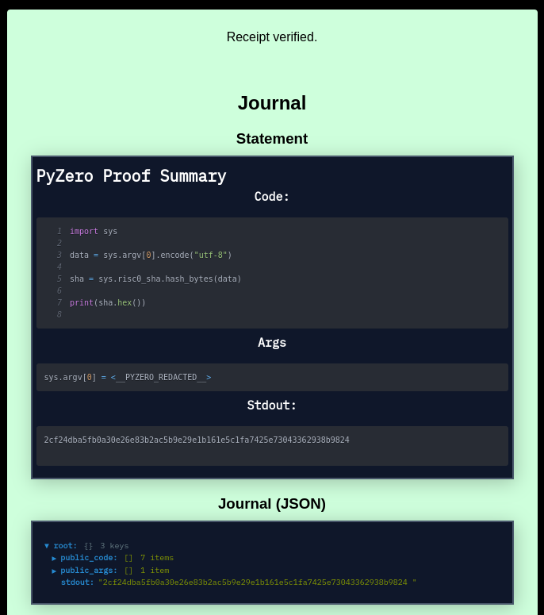

# PyZero

Zero-knowledge proofs for your Python scripts.



Verification example image from [risc0.verify.eqtylab.io](https://risc0.verify.eqtylab.io) ([github repo](https://github.com/eqtylab/risc-zero-verifier))

# Usage

Generate a zero-knowledge proof for a python script
```bash
pyzero my_script.py
```

Generate a zero-knowledge proof for a python script that takes some command line arguments
```bash
pyzero my_script.py -- arg1 arg2
```

Generate a zero-knowledge proof for a python script with lines 1-5 and 7 of the code redacted
```bash
pyzero my_script.py --code-redactions '1-5,7'
```

Generate a zero-knowledge proof for a python script with the first argument redacted
```bash
pyzero my_script.py --arg-redactions '0' -- arg1 arg2
```

Test a python script without generating a proof
```bash
pyzero --dryrun my_script.py
```

Verify a proof generated by pyzero
```bash
pyzero-verify my-proof.json
```

**pyzero**
```present cargo run -p pyzero -- --help
pyzero

Usage: pyzero [OPTIONS] <PYTHON_FILE> [-- [PYTHON_ARGS]...]

Arguments:
  <PYTHON_FILE>     Python code file to run
  [PYTHON_ARGS]...  Python code arguments (sys.argv[..])

Options:
  -c, --code-redactions <CODE_REDACTIONS>
          Code redactions list (example: "5,7-8")
  -a, --arg-redactions <ARG_REDACTIONS>
          Arg redactions list (example: "1,2")
  -j, --journal <JOURNAL_PATH>
          Journal file destination. (optional for convenience, journal is also embedded in proof file)
  -p, --proof <PROOF_PATH>
          Proof file destination [default: proof.json]
  -d, --dryrun
          Execute without generating a proof
  -h, --help
          Print help
  -V, --version
          Print version
```

**pyzero-verify**
```present cargo run -p pyzero-verify -- --help
pyzero-verify

Usage: pyzero-verify <PROOF_FILE>

Arguments:
  <PROOF_FILE>  Proof file to verify

Options:
  -h, --help     Print help
  -V, --version  Print version
```

# Building

PyZero can currently only be built using the latest (as of 2/24/2024) pre-release risc0 rust toolchain. After installing [cargo-risczero](https://github.com/risc0/risc0/blob/main/risc0/cargo-risczero/README.md), the required toolchain can be installed by running
```bash
cargo risczero install --version 'v2024-02-08.1'
```

Build pyzero
```bash
cargo build --release -p pyzero
```

Build pyzero with CUDA GPU acceleration
```bash
cargo build --release -p pyzero --features cuda
```

Build pyzero-verify
```bash
cargo build --release -p pyzero-verify
```

# Justfile

Some build commands are provided in the Justfile for convenience, including commands to run CUDA and non-CUDA builds with docker.

Build pyzero (with docker)
```bash
just docker-build
```

Build pyzero with CUDA GPU acceleration (with docker)
```bash
just docker-build-cuda
```

# How it works

PyZero is built on top of two existing projects:
 - [RISC Zero](https://github.com/risc0/risc0)
 - [RustPython](https://github.com/RustPython/RustPython)

A [fork](https://github.com/cameronfyfe/RustPython/tree/hack-for-risc0) of RustPython is compiled to RISC-V and run in the RISC Zero Virtual Machine. This enables using the same RISC Zero guest image for generating and verifying zero-knowledge proofs for multiple programs written in Python.
